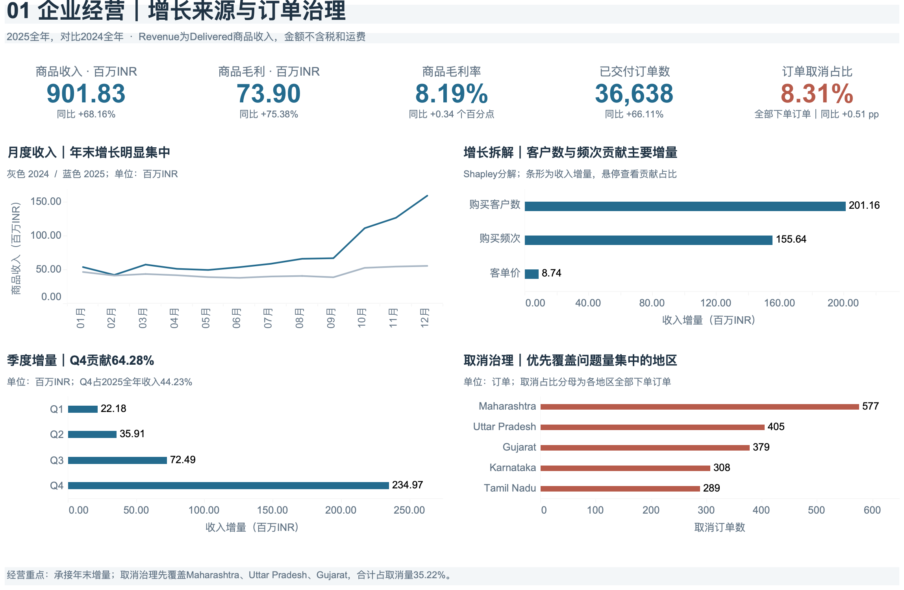
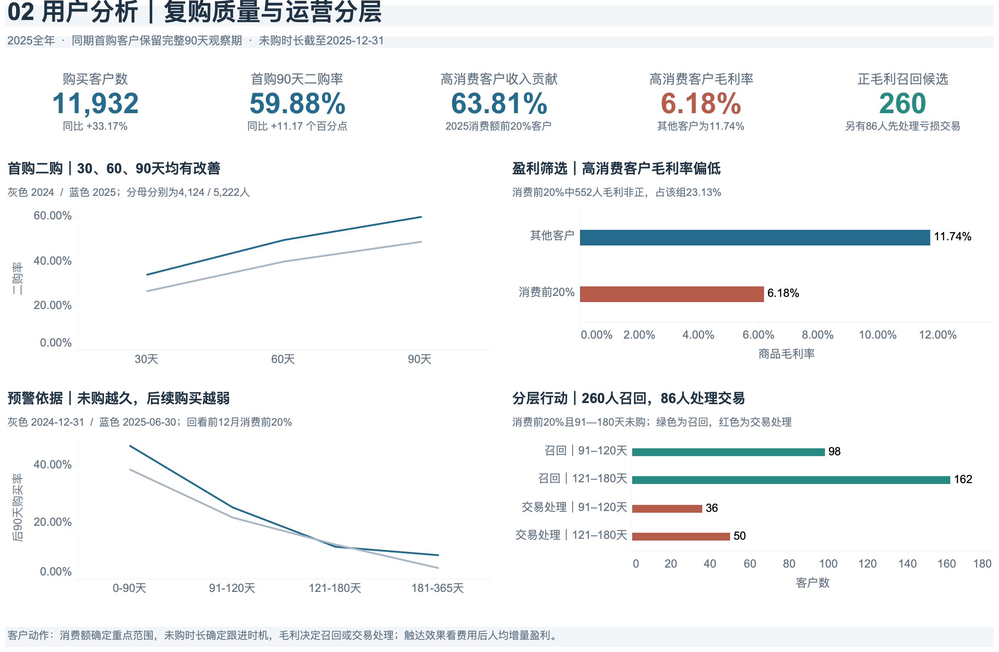
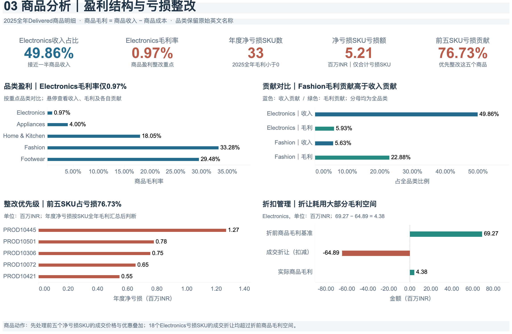

# 2025年电商增长质量与商品盈利分析

**Independent Portfolio Project · 个人独立数据分析作品**  
MySQL 8.0+ / Tableau / Excel

围绕“收入增长是否带来更好的盈利质量”，使用客户、订单、订单商品明细与商品四张表，完成经营增长拆解、客户复购与价值分层、SKU亏损定位及折扣核验。分析期为2025年，对比2024年，保留2023年记录用于数据内首购与最近购买识别。

> 本项目是Independent Portfolio Project，使用Kaggle公开的印度电商合成数据展示个人分析能力，不属于真实公司任职或客户委托项目。金额单位为INR（印度卢比）。业务建议尚未实施验证，不代表已取得收入提升、亏损减少或召回收益。数据来源、选表范围及许可见[数据说明](docs/data_source.md)。

## 快速查看

- [核心分析报告 PDF（10页）](reports/ecommerce_growth_profitability_2025.pdf) / [可编辑 PPTX](reports/ecommerce_growth_profitability_2025.pptx)
- [三张 Dashboard 与 Tableau 工作簿](dashboards/README.md)
- [SQL 分析代码及运行说明](sql/README.md)
- [字段与四表关联模型](docs/data_dictionary.md) / [指标口径](docs/metric_definitions.md)
- [商品核验 Excel](analysis/product_review_2025.xlsx) / [关键结果复核记录](docs/validation.md)

## 业务问题与分析框架

| 业务问题 | 分析方法 | 对应成果 |
|---|---|---|
| 收入增长主要来自哪里？ | 年度/月度/季度对比，Revenue = Buyers × Frequency × AOV，六种替代顺序平均的 Shapley 分解 | 经营 Dashboard、SQL 01、报告第3—4页 |
| 复购是否改善，高消费客户是否高盈利？ | 同期首购客户30/60/90天二购，NTILE(5)消费分层，未购时长回看与毛利筛选 | 客户 Dashboard、SQL 02 |
| 哪些品类和商品拖累毛利？ | 收入与毛利贡献对比，SKU年度净毛利聚合，亏损贡献与累计贡献排序 | 商品 Dashboard、SQL 03、报告第5—9页 |
| 成交折扣是否超出商品毛利空间？ | 折前商品毛利减成交折让的金额桥接，实际加权折扣与商品成本平衡折扣对比 | 报告第8—10页、商品核验 Excel |
| 库存能覆盖多久的近期销量？ | 库存快照除以近30/90天日均销量 | SQL 03、Excel库存覆盖情景；因快照日期不明，仅作情景测算 |

## 核心发现

以下数字已根据原附件四张原始表独立复算，并与现有报告及汇总CSV核对。金额表以**百万 INR**展示。

| 指标 | 2024年 | 2025年 |
|---|---:|---:|
| 商品收入 Revenue | 536.29 | 901.83 |
| 商品毛利 Gross Profit | 42.13 | 73.90 |
| Delivered订单数 | 22,057 | 36,638 |
| 购买客户数 | 8,960 | 11,932 |

1. **收入同比增长68.16%，购买客户数与购买频次合计贡献97.61%的收入增量。** Shapley分解中，客户数、频次、客单价分别贡献201.16、155.64、8.74百万INR。它是描述性的金额分解，不是获客或促销的因果效果。
2. **Electronics收入占比49.86%，毛利率仅0.97%。** 品类收入449.66百万INR，商品毛利4.38百万INR，毛利贡献占比5.93%。应进一步检查商品结构、成本和成交折让。
3. **全品类33个年度净亏损SKU，合计亏损5.21百万INR。** Electronics中的18个亏损SKU贡献96.44%的亏损额。前五个SKU合计占全部亏损SKU亏损额的76.73%，可作为优先核验范围。
4. **Electronics折前商品毛利69.27百万INR，成交折让64.89百万INR，实际商品毛利4.38百万INR。** 这是金额恒等式，不能据此宣称收紧折扣必然增加利润。调整后仍需观察销量、收入与毛利变化。
5. **固定窗口90天二购率由48.71%升至59.88%。** 两年均选取1月1日至10月2日数据内首购客户，样本分别为4,124和5,222人，保留完整90天观察期。
6. **高消费不等于高盈利。** 2025消费前20%的2,387名客户贡献63.81%收入，毛利率为6.18%。其中91—180天未购的346人，按年度商品毛利分为260名正毛利召回候选和86名非正毛利交易核验对象。名单仅为分析输出，未执行营销触达。

证据：[增长贡献](data/aggregated/经营_增长贡献.csv)、[品类毛利率](data/aggregated/商品_品类毛利率.csv)、[前五亏损SKU](data/aggregated/商品_前五亏损SKU.csv)、[固定窗口二购](data/aggregated/客户_固定窗口二购.csv)、[客户分层行动](data/aggregated/客户_分层行动.csv)。

## Dashboard 预览

### 经营增长与订单治理



### 复购质量与客户分层



### 商品盈利与折扣核验



工作簿内嵌15个汇总CSV，为固定分析版本，不自动连接MySQL。PNG可直接浏览，交互需要下载TWBX并在兼容的Tableau中打开。

## 数据与技术实现

**Data Source:** [Indian E-Commerce Sales & Customer Analytics](https://www.kaggle.com/datasets/shiyalkishan01/indian-e-commerce-sales-and-customer-analytics) — **Shiyal Kishan / Kaggle**。发布者说明数据为100%合成，覆盖2023—2025年，页面标注 **CC0 1.0 / Public Domain**。

本项目从原数据集选用 **customers、orders、order_items、products 四张表**。原数据集还包含支付、物流、退货、评论、营销活动等表，本项目未使用这些表。

四表文件名、列数、公开预览字段和具体记录已与上传文件比对一致。附件实测规模：customers 25,000行、orders 100,000行、order_items 254,331行、products 550行。订单日期覆盖2023-01-01至2025-12-31。具体比对范围见[来源核对记录](docs/data_source.md)。

仓库保留报告、看板和汇总数据；原始CSV可从上方Kaggle页面获取。原项目客户级Excel为合成名单，公开版以SQL逻辑与汇总结果展示其方法。

- **MySQL 8.0+**：CTE、表关联、窗口函数、日期处理、客户分层、固定观察窗口与Shapley分解。商品明细先聚合到订单后参与客户分析，避免订单金额重复计算。
- **Tableau**：经营、客户和商品三张Dashboard，基于SQL汇总结果展示。
- **Excel**：商品亏损核验及库存覆盖情景；原项目另有客户级预警名单，公开版仅展示其汇总结果。
- **PowerPoint**：10页业务分析报告，从关键发现到SKU核验与后续监控建议。

核心经营口径为**当前状态Delivered订单，按order_date归属期间**。Revenue不含税和运费，Gross Profit只扣商品成本，Gross Margin为汇总毛利除以汇总收入。年度净亏损SKU先按SKU汇总全年毛利，再筛选负值，不能与所有负毛利明细相加混用。

## 仓库结构

```text
ecommerce-growth-profitability/
├── README.md
├── .gitignore
├── docs/                 # 数据说明、指标口径、复核记录
├── sql/                  # 建表 + 经营、客户、商品三个分析模块
├── dashboards/
│   ├── images/           # 三张静态预览
│   └── ecommerce_2025.twbx
├── reports/              # PDF报告与可编辑PPTX
├── analysis/             # 商品核验Excel及说明
└── data/
    ├── aggregated/       # 15份原有看板汇总CSV
    └── raw/README.md     # 本地数据准备说明，不含原始明细
```

## 复现与限制

无需数据即可浏览报告、截图、SQL与汇总CSV。完整SQL复算可从上述Kaggle来源下载四张原始表，按[运行说明](sql/README.md)导入MySQL。本公开包不是包含原始数据的一键复现包。

本次整理从原始CSV复算关键指标，并检查关联与金额一致性；未在MySQL服务器执行全部SQL，未在Tableau或Excel客户端验证全部交互。TWBX仅清理设备/作者指纹，保留数据连接与分析内容。

四表缺少流量、获客费用、实际支付流水、历史库存及状态流转日志，不能据此计算访问转化率、CAC、企业净利润、实际签收时效或自动补货量。部分交易日期早于商品上市日期，商品快照不适合支持新品生命周期结论。未购回看与首购仅限数据内可见记录，不等于真实历史全量行为。
